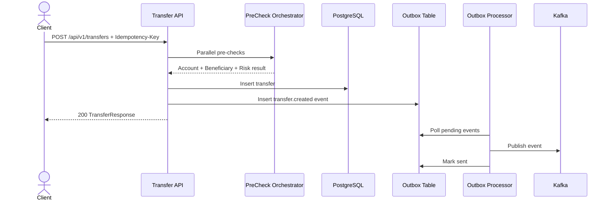

# Architecture

## Context

Finflow is a transaction processing platform for outbound transfers. The system must preserve correctness under retries, partial failures, duplicate submission attempts, and downstream outages.

## Architectural style

This implementation uses a modular monolith instead of multiple microservices.

### Why

- better cost-to-signal ratio for a portfolio repository
- fewer moving parts for local execution
- strong package and transactional boundaries
- easier end-to-end debugging
- still demonstrates distributed-system patterns: outbox, Kafka, retries, idempotency, caching, JWT auth, observability

## Logical components

- **Transfer API**
  - accepts versioned REST requests
  - validates and authorizes commands
- **Pre-check orchestration**
  - performs account lookup, beneficiary screening, and fraud scoring concurrently
- **Transfer persistence**
  - writes durable transaction state to PostgreSQL
- **Outbox**
  - persists domain events atomically with transfer writes
- **Outbox relay**
  - publishes pending events to Kafka with retries
- **Query API**
  - returns transfer state with pagination and filtering
- **Platform layer**
  - security, metrics, health, tracing, configuration

## Core flow

## Persistence rules

- `transfers` is the source of truth for business state
- `outbox_events` is the source of truth for publication intent
- no direct synchronous dependency is allowed to decide whether the transfer record is persisted
- external-service uncertainty degrades toward `MANUAL_REVIEW`, not silent approval

## Resilience posture

- external checks run with retry + circuit breaker + bulkhead
- failures in event publication do not roll back the original transfer write
- duplicates are absorbed via idempotency key + unique constraint
- unhealthy dependencies surface through Actuator health groups

## Scaling model

- horizontal scaling is safe because application nodes are stateless
- PostgreSQL remains the consistency anchor
- Redis absorbs hot reads and expensive reference lookups
- Kafka decouples downstream consumers
- virtual threads reduce request-thread blocking during I/O-bound pre-checks
